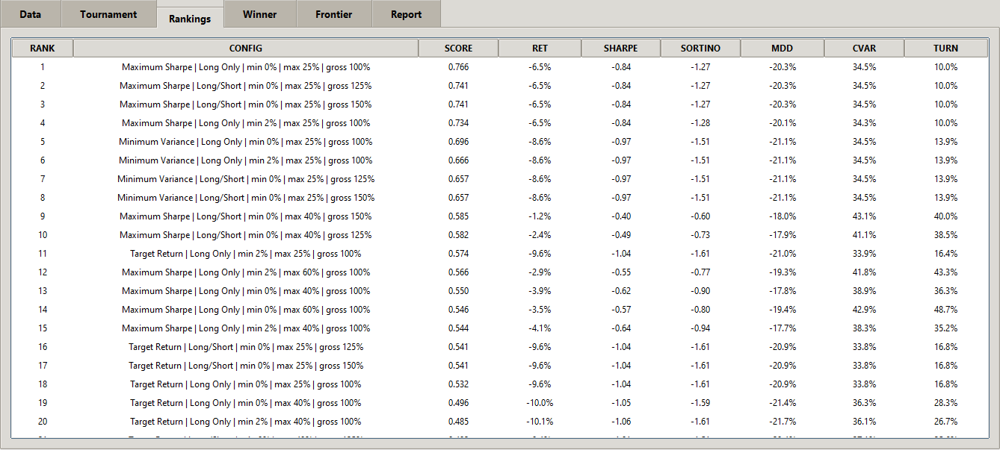
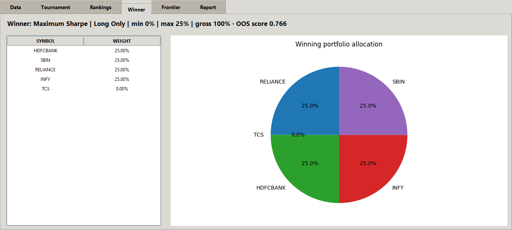
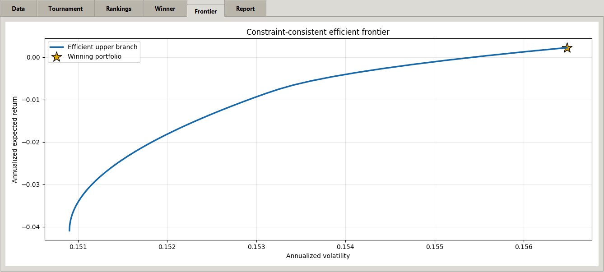
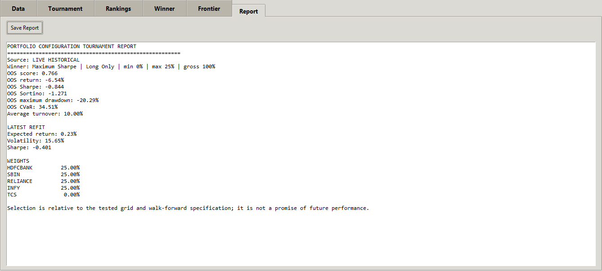

# Minimum Variance Portfolio

A constraint-aware portfolio research engine that tests minimum variance, maximum Sharpe, and target-return objectives across long-only and long/short rules. Each configuration is evaluated with walk-forward out-of-sample data, ranked on risk-adjusted performance, and refitted to produce a constraint-consistent efficient frontier and allocation.

## Why this project exists

Classical mean-variance optimization can produce unstable allocations when expected returns and covariance estimates are noisy. This project treats the optimizer configuration itself as a model-selection problem. It compares objective and constraint combinations instead of assuming one setup is best.

## Core capabilities

- Minimum variance, maximum Sharpe, and target-return objectives
- Long-only and bounded long/short portfolios
- Minimum and maximum position limits plus gross-exposure control
- Expanding walk-forward out-of-sample evaluation
- Composite ranking using Sharpe, Sortino, drawdown, CVaR, volatility, turnover, and return
- Explicit investability gate to distinguish a tradable result from a diagnostic leader
- Constraint-consistent upper efficient frontier
- Reproducible CSV outputs and allocation chart

## Research workflow

1. Convert aligned prices to daily returns.
2. Estimate annualized expected returns and a positive-definite covariance matrix.
3. Generate feasible objective and constraint combinations.
4. Refit every combination through rolling train/test windows.
5. Rank the candidates on out-of-sample risk and return metrics.
6. Apply an investability gate before treating the leader as actionable.
7. Refit the selected rules on all data and draw the matching frontier and allocation.

## Example results

The supplied run completed successfully, but its best-ranked configuration was a **diagnostic leader rather than a strong investment result**. It produced a -6.54% out-of-sample return and -0.844 Sharpe ratio. The program therefore demonstrates correct model comparison and constraint handling, while the results reinforce why an explicit no-trade gate is essential.

### Configuration rankings



### Selected allocation



### Constraint-consistent frontier



### Generated research report



## Installation and use

```bash
git clone https://github.com/your-username/minimum-variance-portfolio.git
cd minimum-variance-portfolio
python -m venv .venv
source .venv/bin/activate  # Windows: .venv\Scripts\activate
pip install -r requirements.txt
python main.py
```

To use your own adjusted-close price data:

```bash
python main.py --prices path/to/prices.csv --risk-free-rate 0.065
```

The CSV must have dates in its first column and one adjusted-close column per asset. Outputs are written to `outputs/`.

## Testing

```bash
pytest -q
```

The tests verify weight bounds, full investment, covariance conditioning, tournament output, investability classification, and frontier generation.

## Important limitations

- Expected returns and covariance remain estimates and can change materially.
- A configuration that wins the tested grid is not necessarily investable.
- Transaction costs, taxes, liquidity, borrow availability, and slippage are not modeled.
- The example screenshots are a historical research run, not a recommendation or promise of future performance.

## Repository structure

```text
minimum-variance-portfolio/
├── main.py
├── src/minimum_variance.py
├── tests/test_engine.py
├── assets/screenshots/
├── outputs/
├── requirements.txt
└── pyproject.toml
```

## License

MIT License. See [LICENSE](LICENSE).
